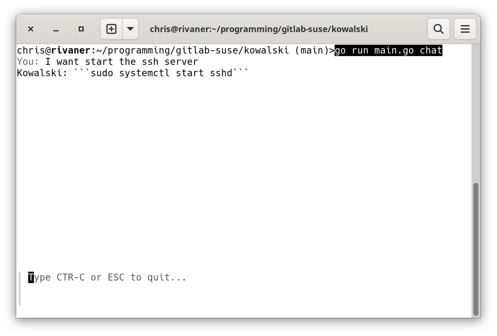

# Kowalski
Kowalski is an AI which helps to configure your system

# Installation

## RPM

RPM packages are available in [OBS](https://build.opensuse.org/package/show/science:machinelearning/kowalski) in `science:machinelearning` project.

[!Note]

Make sure that an ollama instance is started in a seperate terminal with
```
  ollama serve
```

## Source

You need following packages installed
* `go`
* `ollama`
* `faiss-devel` from `science:machinelearning`

After this you will have to dowload the go dependencies with
```
  go mod vendor
```
Now you have to start the ollama service with
```
  ollama serve
```
and in another terminal pull the needed models with
```
  ollama pull gemma3:4b
  ollama pull nomic-embed-text
```
After this you need to create a knowledge database, for this clone the suse docs with
```
  git clone https://github.com/SUSE/doc-modular.git
```
and initialize it with
```
  find PATHTOSUSEDOCS -name \*xml -type f  | xargs go run main.go database add susedoc
```
Finally you can open the chat with
```
  go run main.go chat
```
what should give something like: 

